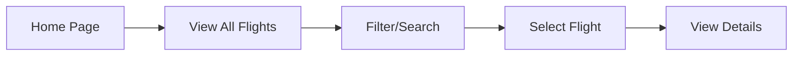
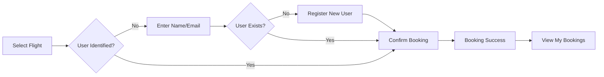
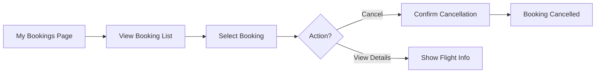

# Galaxium Travels Frontend - Implementation Plan

## 🎯 Project Overview

Build a modern, space-themed frontend for the Galaxium Travels booking system using popular, production-ready technologies. The frontend will provide an intuitive interface for browsing interplanetary flights, making bookings, and managing reservations.

## 🛠️ Technology Stack

### Core Framework & Build Tool
- **React 18** - Popular UI library with hooks and modern patterns
- **TypeScript** - Type safety and better developer experience
- **Vite** - Fast build tool and dev server (much faster than Create React App)

### Styling & UI
- **Tailwind CSS** - Utility-first CSS framework for rapid UI development
- **Framer Motion** - Animation library for smooth transitions and effects
- **Lucide React** - Modern icon library

### Routing & State
- **React Router v6** - Client-side routing
- **React Context API** - Simple state management for user session

### HTTP & Data
- **Axios** - HTTP client for API calls
- **date-fns** - Date formatting and manipulation

### Additional Tools
- **React Hot Toast** - Toast notifications for user feedback
- **clsx** - Conditional className utility

## 🎨 Design Theme: Space Travel

### Color Palette
```css
Primary: Deep Space Blue (#0A1929)
Secondary: Cosmic Purple (#6366F1)
Accent: Nebula Pink (#EC4899)
Success: Alien Green (#10B981)
Warning: Solar Orange (#F59E0B)
Text: Star White (#F9FAFB)
Background: Dark Matter (#030712)
```

### Visual Elements
- Animated starfield background
- Gradient overlays with space colors
- Glassmorphism effects for cards
- Smooth transitions and hover effects
- Planet/rocket icons and imagery
- Futuristic typography

## 📁 Project Structure

```
booking_system_frontend/
├── public/
│   └── vite.svg
├── src/
│   ├── assets/
│   │   └── images/          # Planet images, logos
│   ├── components/
│   │   ├── common/          # Reusable components
│   │   │   ├── Button.tsx
│   │   │   ├── Card.tsx
│   │   │   ├── Input.tsx
│   │   │   ├── Modal.tsx
│   │   │   ├── LoadingSpinner.tsx
│   │   │   └── Starfield.tsx
│   │   ├── layout/
│   │   │   ├── Header.tsx
│   │   │   ├── Footer.tsx
│   │   │   └── Layout.tsx
│   │   ├── flights/
│   │   │   ├── FlightCard.tsx
│   │   │   ├── FlightList.tsx
│   │   │   └── FlightFilters.tsx
│   │   ├── bookings/
│   │   │   ├── BookingCard.tsx
│   │   │   ├── BookingModal.tsx
│   │   │   └── CancelBookingDialog.tsx
│   │   └── user/
│   │       ├── UserIdentification.tsx
│   │       └── UserRegistration.tsx
│   ├── pages/
│   │   ├── Home.tsx
│   │   ├── Flights.tsx
│   │   ├── MyBookings.tsx
│   │   └── NotFound.tsx
│   ├── services/
│   │   └── api.ts            # API client and endpoints
│   ├── types/
│   │   └── index.ts          # TypeScript interfaces
│   ├── hooks/
│   │   ├── useUser.tsx       # User context and hook
│   │   └── useToast.tsx      # Toast notifications hook
│   ├── utils/
│   │   ├── formatters.ts     # Date, currency formatters
│   │   └── validators.ts     # Input validation
│   ├── App.tsx
│   ├── main.tsx
│   └── index.css
├── .env.example
├── .gitignore
├── package.json
├── tsconfig.json
├── vite.config.ts
├── tailwind.config.js
├── postcss.config.js
└── README.md
```

## 🔄 User Flows

### 1. Browse Flights


### 2. Make a Booking


### 3. Manage Bookings


## 📋 Detailed Implementation Steps

### Phase 1: Project Setup (Tasks 1-4)
1. Initialize Vite + React + TypeScript project
2. Install all dependencies
3. Configure Tailwind CSS with custom space theme
4. Set up folder structure and base files

### Phase 2: Core Infrastructure (Tasks 5-6)
5. Define TypeScript interfaces matching backend schemas
6. Create API service layer with all endpoints
7. Set up environment variables for API URL
8. Create user context for session management

### Phase 3: UI Components (Tasks 7-8)
9. Build reusable components (Button, Card, Input, Modal, etc.)
10. Create animated starfield background component
11. Implement responsive layout with header and footer
12. Add navigation with mobile menu

### Phase 4: Pages & Features (Tasks 9-15)
13. **Home Page**: Hero section with CTA, featured destinations
14. **Flights Page**: List all flights with filters (origin, destination, price range)
15. **Flight Cards**: Display flight details with book button
16. **User Flow**: Modal for name/email entry or registration
17. **Booking Modal**: Confirm booking with flight summary
18. **My Bookings Page**: List user's bookings with status
19. **Cancel Booking**: Dialog with confirmation

### Phase 5: Polish & UX (Tasks 16-19)
20. Add loading spinners for async operations
21. Implement error handling with user-friendly messages
22. Add toast notifications for success/error feedback
23. Implement smooth animations and transitions
24. Add hover effects and micro-interactions

### Phase 6: Testing & Documentation (Tasks 20-23)
25. Test all user flows end-to-end
26. Write comprehensive README
27. Add inline code comments
28. Create production build configuration

## 🎯 Key Features

### Must-Have Features
- ✅ Browse all available flights
- ✅ Filter flights by origin/destination
- ✅ View flight details (price, times, seats)
- ✅ User identification (name + email)
- ✅ Book a flight
- ✅ View user's bookings
- ✅ Cancel a booking
- ✅ Responsive design (mobile, tablet, desktop)

### Nice-to-Have Features
- 🌟 Animated starfield background
- 🌟 Smooth page transitions
- 🌟 Toast notifications
- 🌟 Loading states
- 🌟 Error boundaries
- 🌟 Price formatting with currency
- 🌟 Date/time formatting
- 🌟 Search functionality
- 🌟 Sort options (price, departure time)

## 🔌 API Integration

### Endpoints to Implement
```typescript
// Flights
GET /flights                    // List all flights
GET /flights?origin=Earth       // Filter by origin
GET /flights?destination=Mars   // Filter by destination

// Users
POST /register                  // Register new user
GET /user?name=...&email=...   // Get user by credentials

// Bookings
POST /book                      // Create booking
GET /bookings/{user_id}        // Get user's bookings
POST /cancel/{booking_id}      // Cancel booking
```

### Error Handling
- Network errors: Show retry option
- 404 errors: User-friendly "not found" message
- Validation errors: Highlight form fields
- Server errors: Generic error message with support contact

## 📱 Responsive Breakpoints

```css
Mobile: < 640px
Tablet: 640px - 1024px
Desktop: > 1024px
```

### Mobile-First Approach
- Stack cards vertically on mobile
- Hamburger menu for navigation
- Touch-friendly button sizes (min 44px)
- Simplified filters on mobile

## 🎨 Component Examples

### Flight Card
```
┌─────────────────────────────────┐
│ 🚀 Earth → Mars                 │
│                                 │
│ Departure: Jan 1, 2099 09:00   │
│ Arrival:   Jan 1, 2099 17:00   │
│                                 │
│ Price: $1,000,000              │
│ Seats: 5 available             │
│                                 │
│         [Book Now →]            │
└─────────────────────────────────┘
```

### Booking Card
```
┌─────────────────────────────────┐
│ Booking #12345                  │
│ Status: ✅ Booked               │
│                                 │
│ Earth → Mars                    │
│ Jan 1, 2099 09:00              │
│                                 │
│ Booked: Dec 15, 2098           │
│                                 │
│         [Cancel Booking]        │
└─────────────────────────────────┘
```

## 🚀 Getting Started Commands

```bash
# Create project
npm create vite@latest booking_system_frontend -- --template react-ts

# Install dependencies
cd booking_system_frontend
npm install

# Install additional packages
npm install react-router-dom axios date-fns framer-motion
npm install -D tailwindcss postcss autoprefixer
npm install lucide-react react-hot-toast clsx

# Initialize Tailwind
npx tailwindcss init -p

# Run dev server
npm run dev

# Build for production
npm run build
```

## 📝 Environment Variables

```env
VITE_API_URL=http://localhost:8080
```

## ✅ Definition of Done

A task is complete when:
- ✅ Code is written and follows TypeScript best practices
- ✅ Component is responsive on all screen sizes
- ✅ Error handling is implemented
- ✅ Loading states are shown
- ✅ User feedback is provided (toasts/messages)
- ✅ Code is commented where necessary
- ✅ Feature works end-to-end with backend

## 🎯 Success Criteria

The frontend is successful when:
1. Users can browse all flights easily
2. Booking process is intuitive and smooth
3. UI is visually appealing with space theme
4. All features work without errors
5. App is responsive on all devices
6. Performance is good (fast load times)
7. Code is maintainable and well-structured

---

**Ready to implement?** Switch to Code mode to start building! 🚀